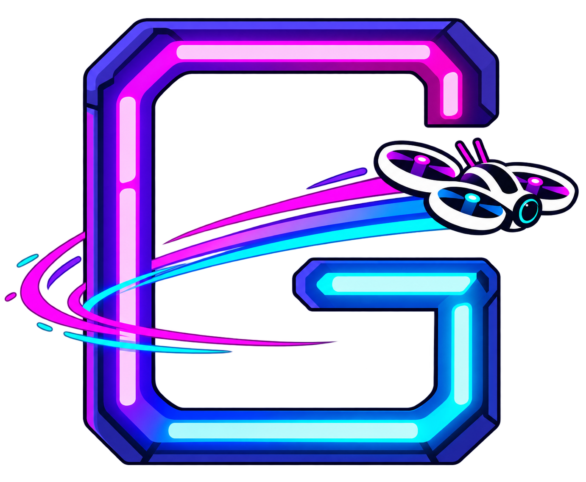

<p align="center">
  
</p>

<h1 align="center">GateStage</h1>

<p align="center">
  <a href="#"></a>
  <a href="https://go-next.co/"></a>
  <a href="https://esphome.io/"></a>
</p>

<h3 align="center">LED gate control for FPV whoop races.</h3>

Your race manager already owns the heat — pilots, frequencies, the start.
When that heat goes live, something still has to drive the start gate, finish arch, and LED cues on the course.

GateStage listens to race events from supported race managers and commands ESPHome gates over the race LAN — so lights go green when they should, without another app to babysit or a cloud hop in between.

## What it is

FPV whoop races need synchronized LED gates — start lights, finish arches, status cues — tied to what your race manager is doing in the heat.

GateStage is a local server on the race LAN. Run it on the timer, the race-director machine, or any other host that can reach both sides of the link.
It subscribes to race events, maps them to gate behaviors you've configured, and drives ESP32 + ESPHome hardware over HTTP.
A web UI serves configuration, manual control, and a live event console to crew browsers that can open the server.

Two things have to be true:

- The host shares a **WiFi subnet** with the gates. Discovery is a UDP broadcast to `255.255.255.255`, and broadcasts stay on that subnet.
- The host can open a **WebSocket** to the race manager (Next, or RotorHazard's Socket.io).

This is not a lap timer — that's Nuclear Hazard / RotorHazard.
This is not a replacement for your race manager.
This is the glue between your race manager and your LED gates.

### Supported race managers

| Race manager | Supported | Status |
|--------------|-----------|--------|
| [Next](https://go-next.co/) | ✓ | Available |
| FPV Trackside | ✗ | Work in progress |
| RotorHazard | ✓ | Available (Socket.io; pilot names pending) |

Select your provider in **Settings**. Use **Detect** to probe the race LAN for Next (`:5702`) or RotorHazard (`:5000` / `rotorhazard.local`), then **Save** to connect. Trackside is still a placeholder.

## Features

- **One server on the race LAN** — GateStage owns the race manager connection, event mapping, and ESPHome commands; browsers are thin clients.
- **Event-driven gate control** — heat start, finish, and configurable routines from race events.
- **Automatic gate discovery** — flashed gates broadcast a UDP beacon; GateStage remembers the fleet and pings last-known IPs. A miss marks a row offline; it does not delete it or move start.
- **Crew-friendly** — binds to `0.0.0.0` so anyone on race WiFi can open settings, the live console, or manual override.
- **Zod-validated config** — settings in `data/config.json` with export/import via `GET/POST /api/config`.
- **Dev without hardware** — mock Next and ESPHome servers simulate a full heat sequence on your laptop.

## Quick Start

**Requirements:** Node.js 20+, npm.

Clone the repo and run the server on any machine that shares a WiFi subnet with the gates and can reach the race manager over WebSocket. The timer is a fine host. So is the race-director machine.

```sh
git clone https://github.com/pluggedinn/GateStage.git
cd GateStage
npm install
npm run build
npm start
```

Open [http://127.0.0.1:8080](http://127.0.0.1:8080) on that machine, or `http://<host>:8080` from a crew browser on the same WiFi. How you keep the process up — a shell, systemd, a container — is yours.

### Develop without hardware

Mock servers stand in for Next and the ESP32 gates:

```sh
npm install
npm run dev:mocks
```

Open [http://127.0.0.1:8080](http://127.0.0.1:8080)

Emit a test race event:

```sh
curl -X POST http://127.0.0.1:9401/emit \
  -H 'Content-Type: application/json' \
  -d '{"type":"heat.go"}'
```

Run a full heat sequence (fast):

```sh
curl -X POST http://127.0.0.1:9401/sequence \
  -H 'Content-Type: application/json' \
  -d '{"speed":20}'
```

Check mock ESPHome gate commands:

```sh
curl http://127.0.0.1:9080/state   # gate-start
curl http://127.0.0.1:9085/state   # gate-finish
```

## How It Works

```
  Race manager (Next, RotorHazard, …)
       │  WebSocket
       ▼
 ┌──────────────────────────────────────┐
 │ GateStage                            │
 │ timer, RD machine, or any host       │
 │ on the same subnet as the gates      │
 │ maps events → gate actions           │
 │ persists config (JSON)               │
 └──┬──────────────┬────────────────────┘
    │ HTTP REST    │ Socket.io
    ▼              ▼
 ESPHome gates   Browser UIs
 (same subnet)   (anyone who can reach :8080)
```

The server connects to the race manager, translates race events into ESPHome REST calls, and pushes live events to every browser tab that has the UI open.
Gate discovery uses a UDP beacon on port **9420** (`{"v":1,"id":"gate-start","rssi":-62,"tC":47.5}` to `255.255.255.255`). Known gates stay in the list; health is unicast HTTP to the last-known IP. Firmware `mdns:` is for ESPHome OTA / `*.local` only.

Full hardware and networking context lives in [AGENTS.md](./AGENTS.md#architecture).

## Configuration

Settings are stored in `data/config.json` (gitignored).
Gates are remembered in that file. New flashed gates appear from UDP beacons; Scan Now broadcasts WHO and pings last-known hosts.
Race-manager **Detect** (Settings) is a separate LAN port probe + fingerprint — not the gate UDP beacon.

Operational logs append to `data/gatestage.log` (same directory as config). Restarts keep writing to the same file. Override with `GATESTAGE_LOG_PATH`. Open **Logs** in the UI to tail the file, or read it on disk after a race day. At ~10 MB the file rotates once to `gatestage.log.1`.

Trigger a scan anytime:

```sh
curl -X POST http://127.0.0.1:8080/api/gates/discover
```

With `npm run dev:mocks` (`ESPHOME_MOCK_FLEET=1`), six mock gates join discovery on ports 9080–9085: `gate-start`, `gate-2` … `gate-5`, `gate-finish`.

Export/import via `GET/POST /api/config`.

### Dev ports

| Service | Port | URL |
|---------|------|-----|
| GateStage | 8080 | http://127.0.0.1:8080 |
| Mock Next WebSocket | 9400 | ws://127.0.0.1:9400 |
| Mock Next HTTP control | 9401 | http://127.0.0.1:9401 |
| Mock ESPHome fleet | 9080–9085 | gate-start … gate-finish |
| GateStage UDP beacons | 9420 | `255.255.255.255:9420` |

## Scripts

| Command | Description |
|---------|-------------|
| `npm run dev:mocks` | Mock Next + mock ESPHome + GateStage |
| `npm run dev` | GateStage server only (expects mocks or real hardware) |
| `npm run mock:next` | Mock Next RD WebSocket server |
| `npm run mock:esphome` | Six mock ESPHome REST servers (ports 9080–9085) |
| `npm run mock:esphome:single` | One mock ESPHome server on port 9080 |
| `npm run test` | Unit tests |
| `npm run test:e2e` | Playwright E2E tests |
| `npm run build` | Production Next build |
| `npm run start` | Production server (`tsx server.ts`) |

## Documentation

- [AGENTS.md](./AGENTS.md) — **start here for coding agents** (architecture, conventions, commands)
- [docs/DESIGN.md](docs/DESIGN.md) — UI design system and semantic color tokens
- [docs/ESPHOME.md](docs/ESPHOME.md) — gate firmware setup ([docs/examples/gate.yaml](docs/examples/gate.yaml), XIAO ESP32-C5 + WS2811)

## Race environment

GateStage runs on any host that shares the gate subnet and can reach the race manager — the timer, the race-director machine, or another box on that WiFi. ESP32 gates join the **same 5 GHz race WiFi and subnet**. Server binds to `0.0.0.0` so crew open `http://<gatestage-host>:8080`. No login in v1 — trusted LAN.

**Race day checklist**

1. Race WiFi AP up (5 GHz; Channel 36 preferred — keeps WiFi away from analog VTX on Raceband)
2. Race manager running and reachable over WebSocket (Next, RotorHazard, or your stack)
3. GateStage on the same WiFi subnet as the gates; crew URL shared
4. All ESP32 gates online on that subnet (DHCP reservations help)
5. Internet optional — timing and gate control work offline on the LAN

## License

MIT — see [LICENSE](./LICENSE).
