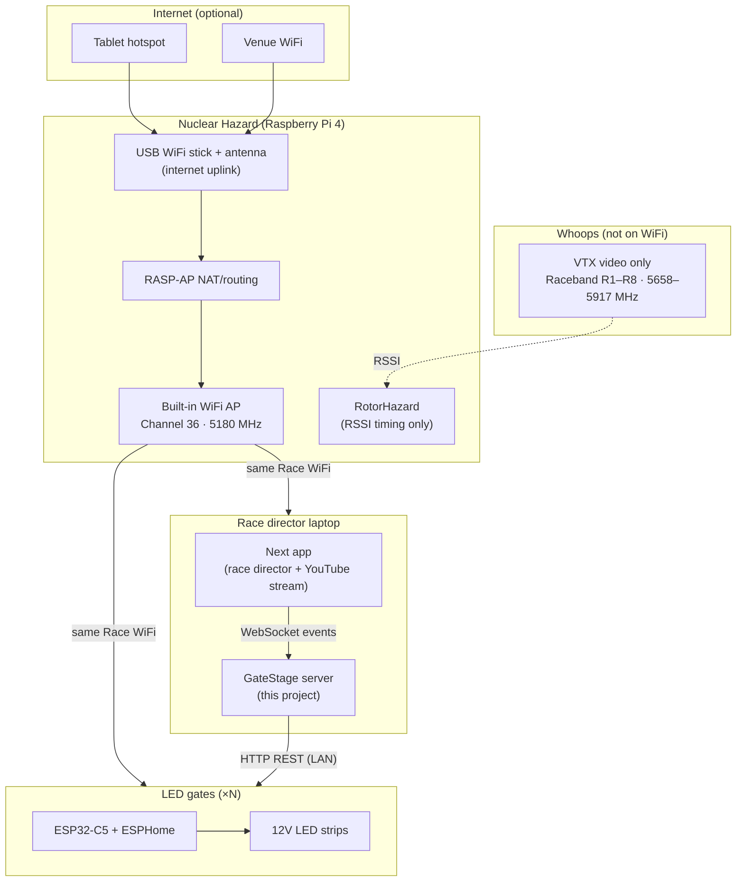

# GateStage — System Architecture

This document describes the **physical race setup** and how GateStage fits into it. Written for developers and agents who need context beyond the code.

---

## Overview



---

## Hardware components

### Nuclear Hazard (timer + router)

- Commercial RotorHazard-based timer from [NuclearQuads](https://nuclearquads.com/) (Fission model)
- Black 3D-printed enclosure; runs RotorHazard on Raspberry Pi 4
- **4 timing nodes** — read RSSI from drone VTX on Raceband frequencies
- **Not** the race director UI; Next is the director software

### WiFi / networking (RASP-AP on the Pi)

| Interface | Role |
|-----------|------|
| **Pi built-in WiFi (`wlan0`)** | 5 GHz access point — **Channel 36 (5180 MHz / 5.18 GHz)** — the race LAN |
| **USB WiFi dongle (AC600 + antenna)** | WiFi client only — uplink to **tablet hotspot** OR **venue WiFi** for internet |

**Why Channel 36:** Keeps race WiFi at the low end of 5 GHz, away from analog whoop VTX on Raceband (5658–5917 MHz). Reduces interference between WiFi and video.

**Internet is optional for core racing.** Timing and GateStage gate control work offline on the race LAN. Internet is mainly for YouTube streaming from the race director laptop.

### Race director laptop

- Connected to the Nuclear Hazard race WiFi
- Runs **Next** ([go-next.co](https://go-next.co/)) — heats, pilots, frequencies, race flow, YouTube stream
- Runs **GateStage** — listens to Next events, controls gates, serves web UI

Both apps run on the **same machine**. GateStage connects to Next over localhost WebSocket (exact URL TBD — see open questions in [AGENTS.md](../AGENTS.md)).

### LED gates

- **ESP32-C5** boards running **ESPHome**
- **12V LED strips** (WS2812-style or similar — confirm strip type per gate)
- Each gate on the **same race WiFi** as the laptop (not a separate network)
- Power: separate 12V PSU per strip; common ground with ESP logic; level shifting as needed

### Drones (whoops)

- **Do not connect to WiFi**
- Transmit **analog video** on Raceband **R1–R8 (5658–5917 MHz)**
- Detected by Nuclear Hazard nodes via RSSI; crossing data flows to Next via the Next ↔ RotorHazard integration

---

## Software data flow (GateStage)

```
Next RD app  ──WebSocket──▶  GateStage server (race brain)
                                    │
                                    ├──▶ JSON config (data/config.json)
                                    ├──▶ ESPHome HTTP (gate commands)
                                    └──▶ Socket.io ──▶ browser UIs (RD + crew)
```

### Design principle: server is the brain

- **One** GateStage server process on the RD laptop owns:
  - The WebSocket connection to Next
  - Event → action mapping
  - ESPHome commands
  - Config persistence
- **Browsers** (including on other devices) are thin clients: settings, live log, manual override
- Server binds to **`0.0.0.0`** so crew can open `http://<rd-laptop-ip>:8080` on race WiFi

---

## Network checklist (race day)

1. Nuclear Hazard AP up on Channel 36
2. USB dongle has internet (tablet hotspot preferred over venue WiFi for streaming)
3. RD laptop on race WiFi
4. Next app running and connected to RotorHazard timer IP
5. GateStage running; crew URL shared
6. All ESP32 gates online on race WiFi (DHCP reservations recommended)
7. VTX plan: Raceband high channels, 25 mW indoor whoops

---

## Related integrations (not GateStage)

| System | Integration |
|--------|-------------|
| Next ↔ RotorHazard | Official plugin; timer IP + port in Next settings |
| Next ↔ pilots | Next mobile app |
| GateStage ↔ Next | **To be implemented** — WebSocket event stream |

---

## Diagram asset

A non-technical infographic was produced during project planning (FPV RACE SYSTEM — HOW IT ALL CONNECTS). It shows tablet/venue internet, Nuclear Hazard, Race WiFi Channel 36, laptop running Next + GateStage, gates on same WiFi, and drones on Raceband only. Regenerate or export into `docs/assets/` if needed for team Discord/docs.
